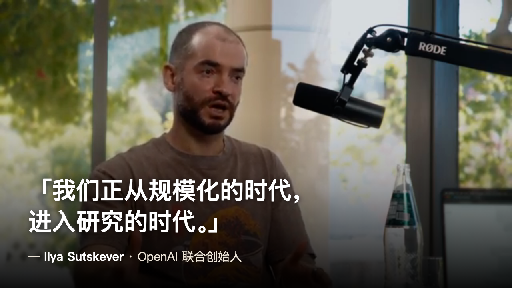
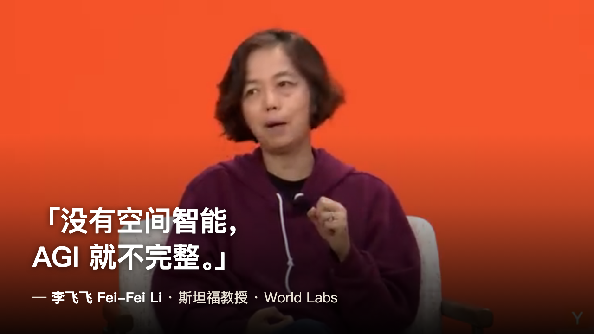
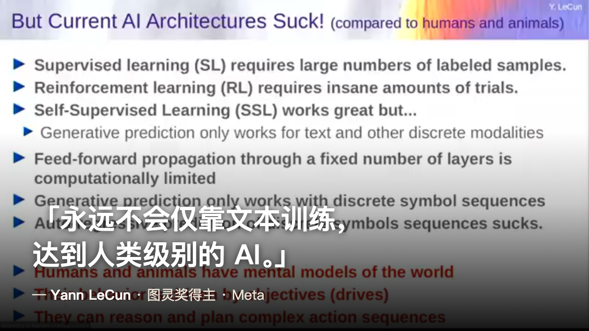
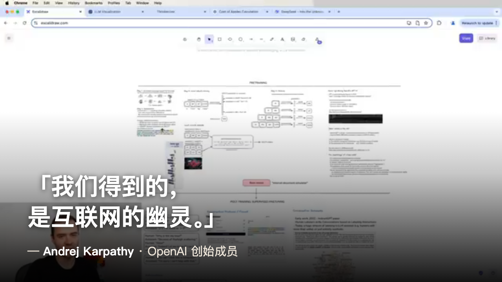
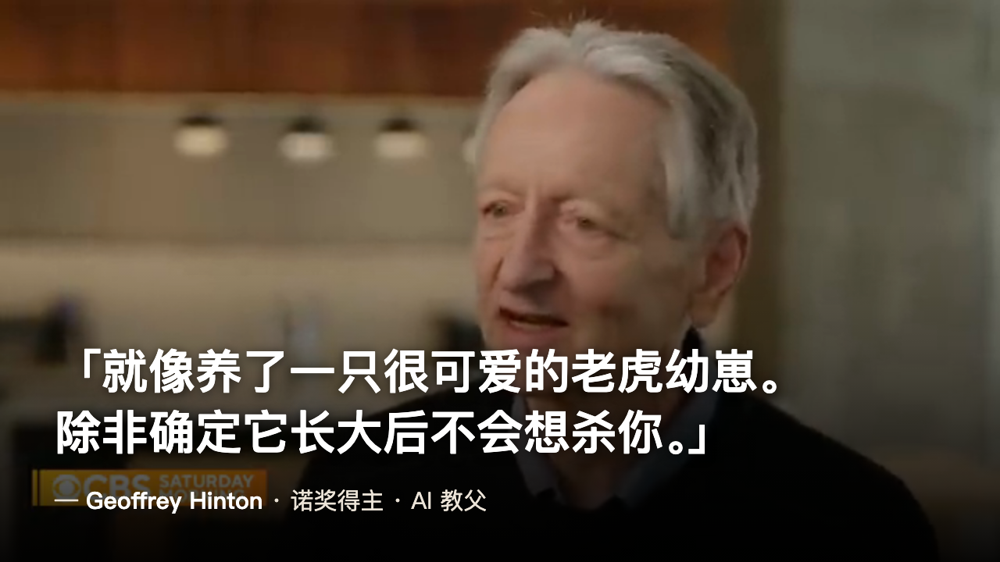
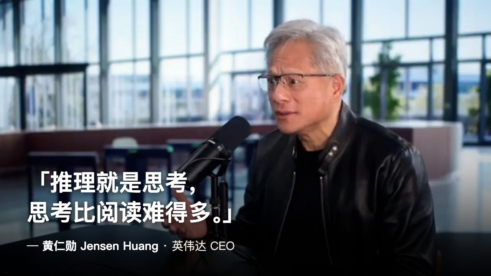
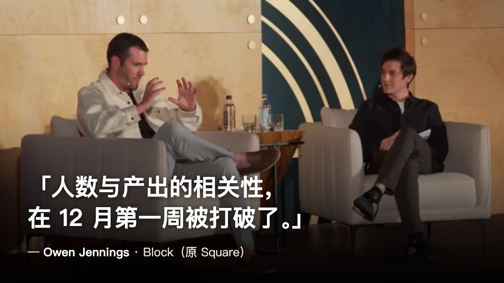

# 顶级 AI 大脑集体踩刹车:AI 产品经理的核心打法,正在重排

> 《本周 AI 必读》第 1 期

> 角度:前沿在踩刹车,产业在踩油门。
> 状态:**定稿待发**——三处判断已是作者本人观点(信前沿 / AI 替代人工已常见 / 赌明天做 AI-first)。
> 所有引用均来自库里真实金句(88 分以上内容);7 张金句图为「视频里大佬说这句话」的真实截图 + 烧字幕(`docs/images/shot-*.png`,1280×720)。
> 标题已定。待办:① 把 7 张图传公众号(md 里是相对路径) ② 发布(公众号 / 即刻)。

---

> 我每周把全网 AI 的噪音,过滤成几条真正值得你花时间的。这是第一期。

这周我把库里分最高的几条摆在一起,发现一件怪事。

五个顶级大脑,吵起来了。

一边是搞研究的——Ilya、李飞飞、LeCun、Karpathy。他们的意思出奇地一致:**现在这套大模型,快走到头了。**

另一边是干产业的——黄仁勋、Block 的 Owen。他们在说另一句话:**红利才刚开始,而且已经落地了。**

一个踩刹车,一个踩油门。同一周,同一个行业。这事值得说道说道。

## 一、踩刹车的:旧范式到顶了

**Ilya Sutskever**(OpenAI 联合创始人)把话挑明了:

> 「我们正从规模化的时代进入研究的时代。规模化告诉人们该做什么,但现在我们需要新的想法。」

翻译一下:过去几年靠堆数据、堆算力就能涨,这条路的红利吃得差不多了。模型在跑分上很猛,到现实里却笨手笨脚。

**李飞飞**说得更狠。在她看来,语言模型只是冰山一角:

> 「对我而言,没有空间智能,AGI 就不完整。」

机器得能理解 3D 的、物理的世界。光会聊天,不算数。

**LeCun**(图灵奖得主、Meta 首席 AI 科学家)直接开怼:

> 「我们永远不会通过仅仅在文本上训练,达到人类级别的 AI,不管某些硅谷 CEO 怎么说。」

而 **Karpathy** 干脆给你拆穿大模型到底是个啥。他用三小时讲完训练全过程,最后落到一句:

> 「预训练本质上是对互联网的压缩——不是无损,是有损。我们得到的,是互联网的幽灵。」

幽灵。你天天对话的 ChatGPT,本质是一段被压缩过的互联网回声。

旁边还坐着个更吓人的——**Hinton**,刚拿诺奖的「AI 教父」。他不聊技术路线,聊风险:超级智能可能 4 到 19 年内到来,有 10% 到 20% 的概率失控。

> 「我们就像养了一只很可爱的老虎幼崽。除非你能确定它长大后不会想杀你,否则你该担心。」

**我的判断:我信前沿派,而且是肯定。**

靠堆数据、堆算力往上涨,这条路我不觉得还能撑太久。连 Ilya 这种亲手把规模化推到顶的人,都说「得换新想法了」——这话从他嘴里出来,比谁都有分量。所以「到顶论」我不当成大佬造势,我当成信号:下一波机会,要从别的地方长出来了。

## 二、踩油门的:红利已经落地

镜头转到产业这边,画风完全不一样。

**黄仁勋**在 Lex 的播客里拆英伟达。他有个判断:AI 的战场,正从「检索」转向「生成和推理」。

> 「推理就是思考,思考比阅读难得多。」

意思是,真正烧算力的时代才刚开始,远没到顶。前沿派说模型到头了,老黄说算力需求还要再翻几个数量级。

最扎心的是 **Block(原 Square)的 Owen Jennings**。他们裁了 40% 的人,但理由不是缺钱:

> 「公司人数和产出之间的相关性,在 12 月的第一周被打破了。一两个工程师借助工具,可以做到 10 倍、20 倍、100 倍。」

注意,这不是预测。是已经发生的事。

**有没有实感?太有了。**

AI 替代人工这事,现在常见到我都懒得惊讶了。Block 裁 40% 上了新闻,但在我看,这只是被摆到台面上的那一个。更多的替代是悄悄发生的——岗位没了,招人少了,一个人扛过去三个人的活。它早就不是「未来会怎样」,是「现在就这样」。

## 三、对一个 AI 产品人,这意味着什么

把两边放一起,我有个粗暴的判断:

**别把宝全押在「模型继续变大」上。**

- 想吃现在就能吃的红利:往「应用 + 组织重构」走。Block 已经证明,工具能把单人产出拉高一个量级。这是今天的钱。
- 想赌未来:盯「新范式」。空间智能、世界模型、推理——这是 Ilya、李飞飞们押的方向。这是明天的钱。
- 最危险的位置:做一个「只是给大模型包层壳、赌它明年更强」的产品。两头都不靠。

**我自己怎么选?我赌明天。**

我要做的,是真正 AI-first 的产品——不是在老软件上贴个 AI 按钮,是从第一行需求就假设「AI 是核心,不是插件」。今天的红利(用 AI 把团队产出拉高)我当然也吃,但那是手段。真正想押的,是下一个范式起来的时候,我的东西天生长在新地基上,而不是被拍在沙滩上。

---

这就是第一期。这些全是库里 88 分以上的内容,我都看完了才敢推给你。

想看哪条的完整版,回我一个序号,我把链接发你。

下周见。

🔇 降噪
